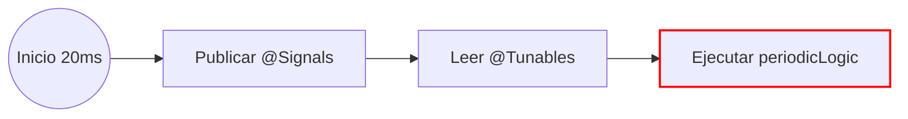

# IOSubsystem Base

**IOSubsystem** es la clase base de alto rendimiento sobre la que debes construir tus subsistemas en **ForgeMini**.

A diferencia de un `SubsystemBase` normal de WPILib, esta clase abstrae por completo la complejidad de NetworkTables. En lugar de escribir código repetitivo para publicar y leer datos, tú defines variables y métodos anotados, y el **IOSubsystem** se encarga de sincronizarlos automáticamente.

---

## **Implementación**

Para utilizar esta clase base, sigue estas reglas al crear tus subsistemas:

1.  Extender de `IOSubsystem` en lugar de `SubsystemBase`.
2.  Pasar el nombre de la tabla al constructor usando `super("Nombre")`.
3.  **IMPORTANTE:** Sobrescribir el método `periodicLogic()` en lugar de `periodic()`.

### **El Ciclo de Vida**

Tu subsistema ejecuta el siguiente flujo automáticamente cada 20ms (o el tiempo de ciclo del robot):



1.  **Ejecución de Signals:** Se publican los datos del robot hacia el Dashboard.
2.  **Ejecución de Tunables:** Se actualizan las variables del robot con datos del Dashboard.
3.  **Ejecución de Lógica:** Se ejecuta tu código personalizado en `periodicLogic()`.

---

## **Ejemplo Completo**

El siguiente ejemplo muestra un subsistema de disparo (Shooter) implementado con **ForgeMini**. Nota la ausencia de llamadas manuales a `NetworkTable`.

=== "Shooter.java"

    ```java
    package frc.robot.subsystems;

    import com.stzteam.forgemini.io.IOSubsystem;
    import com.stzteam.forgemini.io.Signal;
    import com.stzteam.forgemini.io.Tunable;

    public class Shooter extends IOSubsystem {

        // ==========================================
        // INPUTS (@Tunable)
        // Valores que cambias desde el Dashboard y se inyectan aquí
        // ==========================================
        
        @Tunable(key = "kP")
        public double kP = 0.005;

        @Tunable(key = "Target RPM")
        public double targetRpm = 3000.0;

        // Variables internas
        private double currentRpm = 0.0;

        public Shooter() {
            // Define el nombre de la carpeta en NetworkTables
            super("Shooter"); 
        }

        // ==========================================
        // LÓGICA DEL ROBOT
        // ==========================================
        
        @Override
        public void periodicLogic() {
            // Aquí va tu código normal.
            // Las variables 'kP' y 'targetRpm' ya tienen los valores actualizados.
            
            double voltage = calculatePid(targetRpm, currentRpm, kP);
            motor.setVoltage(voltage);
            
            // Simulación simple de física
            currentRpm += (voltage * 100) - 50; 
        }

        // ==========================================
        // OUTPUTS (@Signal)
        // Métodos que se publican automáticamente
        // ==========================================

        @Signal(key = "Current RPM")
        public double getRpm() {
            return currentRpm;
        }

        @Signal(key = "Is Ready", onChange = true)
        public boolean isAtSpeed() {
            return Math.abs(targetRpm - currentRpm) < 50;
        }
    }
    ```

!!! danger "Advertencia Crítica"
    **NO sobrescribas el método `periodic()` estándar.**
    Si lo haces, eliminarás la lógica interna de `IOSubsystem` y las anotaciones `@Signal` y `@Tunable` dejarán de funcionar. Usa siempre `periodicLogic()`.

---

## **Optimizaciones Automáticas**

El código fuente de `IOSubsystem` incluye optimizaciones avanzadas para gestionar diferentes tipos de datos:

| Tipo de Dato | Optimización |
| :--- | :--- |
| **Primitivos** (`double`, `boolean`) | Utiliza verificación de cambios (Dirty Checking). Solo actualiza la red si el valor realmente cambió respecto al ciclo anterior. |
| **Strings** | Realiza una verificación `equals()` antes de enviar a la red para ahorrar ancho de banda. |
| **Structs** (`Pose2d`, etc.) | Detecta automáticamente si la clase soporta Structs y delega la serialización eficiente a `NetworkIO`. |

### **Filtrado de Señales**

Puedes reducir drásticamente el uso de CPU y ancho de banda configurando los parámetros de la anotación `@Signal`:

* **`onChange = true`**: Solo envía el dato si su valor ha cambiado respecto al ciclo anterior. Ideal para booleanos de estado o modos.

    ```java
    // Solo envía actualización cuando el sensor cambia de estado (no cada 20ms)
    @Signal(key = "LimitSwitch", onChange = true)
    public boolean getLimitSwitch() {
        return m_limitSwitch.get();
    }
    ```

* **`slowScale = N`**: Solo actualiza el valor una vez cada *N* ciclos. Útil para datos de diagnóstico o temperaturas que no requieren alta frecuencia.

    ```java
    // 50 ciclos * 20ms = Actualiza 1 vez por segundo
    @Signal(key = "Motor Temp", slowScale = 50)
    public double getMotorTemp() {
        return m_motor.getTemperature();
    }
    ```

### **Ejemplo con Objetos Complejos (Structs)**

`IOSubsystem` soporta nativamente objetos complejos como `Pose2d`, `ChassisSpeeds` o `SwerveModuleState`. No necesitas hacer nada especial, simplemente retorna el objeto y la librería usará **Magic Structs** para serializarlo.

=== "DriveTrain.java"

    ```java
    public class DriveTrain extends IOSubsystem {
        
        public DriveTrain() {
            super("DriveTrain");
        }

        @Override
        public void periodicLogic() {
            m_odometry.update(m_gyro.getRotation2d(), m_modules.getPositions());
        }

        // ==========================================
        // SIGNAL CON POSE2D
        // ==========================================
        
        // Se publica automáticamente como struct array compatible con AdvantageScope
        @Signal(key = "RobotPose")
        public Pose2d getPose() {
            return m_odometry.getPoseMeters();
        }
    }
    ```

---

## **Limpieza de Recursos**

Si necesitas detener el funcionamiento del subsistema o liberar recursos (por ejemplo, durante pruebas unitarias), la clase proporciona un método de cierre.

```java
// Cierra todos los Publishers y Subscribers asociados a esta tabla
myShooter.close();

```