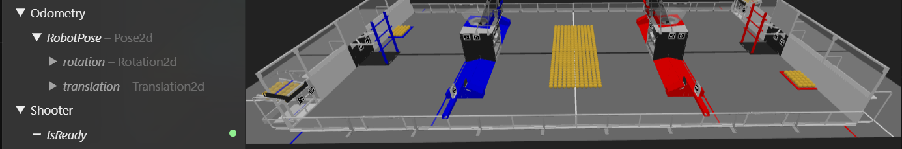

# NetworkIO

**NetworkIO** es el motor estático de bajo nivel que maneja la comunicación entre el Robot y la red.

A diferencia de la implementación estándar de WPILib, esta clase administra automáticamente el ciclo de vida de los `Publishers` y `Subscribers` usando un sistema de **Caché Inteligente**, evitando la creación costosa de objetos en cada ciclo.

---

## **Organización Modular**

Una de las filosofías de **ForgeMini** es mantener la arquitectura de datos limpia y estructurada. 

En lugar de volcar todos los datos en la tabla `SmartDashboard` (que suele convertirse en un "cajón de desastre" desordenado), **NetworkIO** fomenta la creación de tablas raíz dedicadas para cada subsistema.

### **Ventajas de las Tablas Propias**

Al usar `NetworkIO.set("DriveTrain", ...)` o `NetworkIO.set("Shooter", ...)` obtienes:

1.  **Jerarquía Profesional:** Tus datos se ven organizados lógicamente en herramientas como **Glass** o **[AdvantageScope](https://docs.advantagescope.org/)**.
2.  **Depuración Focalizada:** Si solo quieres ver qué pasa con el sistema de visión, abres la tabla `Vision` y no te distraes con 50 variables del chasis.
3.  **Ancho de Banda Optimizado (NT4):** Las herramientas pueden suscribirse solo a la tabla `/Shooter` sin consumir recursos recibiendo datos innecesarios de otros sistemas.

=== "Estructura ForgeMini (Recomendada)"

    Tablas independientes en la raíz:
    
    ```text
    NetworkTables Root
    ├── DriveTrain/          <-- Limpio y aislado
    │   ├── Pose
    │   └── Velocity
    ├── Shooter/             <-- Limpio y aislado
    │   ├── RPM
    │   └── IsReady
    └── Vision/              <-- Limpio y aislado
        └── Targets
    ```

=== "Estructura Clásica (No recomendada)"

    Todo mezclado en SmartDashboard:

    ```text
    NetworkTables Root
    └── SmartDashboard/
        ├── Drive_Pose       <-- Desordenado
        ├── Drive_Velocity   <-- Desordenado
        ├── Shooter_RPM      <-- Desordenado
        ├── Vision_Targets   <-- Desordenado
        └── Auto_Mode
    ```



*Datos publicados con `NetworkIO` mostrados en AdvantageScope*

!!! tip "Compatibilidad"
    Aunque recomendamos usar tablas propias, `NetworkIO` es flexible. Si por alguna razón necesitas usar la tabla clásica por compatibilidad con un Dashboard viejo, simplemente usa:
    `NetworkIO.set("SmartDashboard", "MiDato", valor);`

## **Enviar Datos `Set`**

Para enviar datos a la red, usa el método estático `set`. NetworkIO decidirá automáticamente si usar una implementación optimizada para primitivos o la lógica de Structs.

### **Primitivos**

```java
    // Enviando números (Double)
    NetworkIO.set("DriveTrain", "Speed", 4.5);
    NetworkIO.set("Shooter", "RPM", 3500.0);

    // Enviando booleanos (Boolean)
    NetworkIO.set("Intake", "IsDeployed", true);

    // Enviando texto (String)
    NetworkIO.set("Auto", "Status", "Running Path A");
```

**Tipos soportados:** `double`, `boolean`, `String`.

### **Objetos complejos**

```java

// Objetos Complejos (Usa Magic Structs)
// Automáticamente detecta que Pose2d tiene un struct y lo publica
NetworkIO.set("Odometry", "RobotPose", currentPose);

```

!!! tip
    Puedes pasarle a *NetworkIO* **cualquier objeto de WPILib que soporte Structs** (como `Translation2d`, `Rotation2d`, `ChassisSpeeds`) sin configuración extra.

!!! success "Magic Structs"
    No necesitas registrar nada manual. `NetworkIO` inspecciona el objeto en tiempo de ejecución, encuentra su campo `.struct` automáticamente y lo serializa de la forma más eficiente para **NetworkTables 4.0**.

---

## **Recibir Datos `Gets`**

Para leer valores desde el Dashboard (útil para sintonizar PIDs o cambiar constantes sin redesplegar código), utiliza el método `NetworkIO.get`.

Este sistema es **seguro por defecto**: siempre debes proporcionar un `defaultValue`. Si la conexión se pierde o la clave no existe en NetworkTables, tu robot usará ese valor por defecto en lugar de crashear.

```java
    // Leyendo un PID (Si no existe, usa 0.0)
    double kP = NetworkIO.get("DriveTrain", "kP", 0.0);

    // Leyendo un interruptor (Si no existe, usa false)
    boolean isDebug = NetworkIO.get("Global", "DebugMode", false);

    // Úsalo directamente en tu lógica
    if (NetworkIO.get("Shooter", "ForceFire", false)) {
    shoot();
    }
```

Tipos soportados: `double`, `boolean`.

!!! warning "Seguridad"
    Siempre asegúrate de que el defaultValue sea un valor seguro para tu robot (ej. velocidad 0.0), ya que será el valor que se use si el Dashboard se desconecta.

---

## **Ejemplo de Implementación (Manual)**

=== "SimpleShooter.java"

    ```java
    package frc.robot.subsystems;

    import edu.wpi.first.wpilibj2.command.SubsystemBase;
    import com.stzteam.forgemini.io.NetworkIO; // 1. Importar la librería

    public class SimpleShooter extends SubsystemBase {
        
        // Definimos el nombre de la tabla una sola vez para evitar errores de dedo
        private static final String TABLE = "Shooter";
        
        private double currentRPM = 0.0;
        private double kP = 0.005;

        public SimpleShooter() {
            // Opcional: Publicar valores iniciales para que aparezcan en Glass
            NetworkIO.set(TABLE, "TargetRPM", 3000.0);
        }

        @Override
        public void periodic() {
            // =================================================
            // 1. TELEMETRÍA (Outputs)
            // =================================================
            // Publicamos el estado actual del mecanismo
            NetworkIO.set(TABLE, "CurrentRPM", currentRPM);
            NetworkIO.set(TABLE, "IsReady", currentRPM > 2900);

            // =================================================
            // 2. SINTONIZACIÓN (Inputs)
            // =================================================
            // Leemos valores en tiempo real para ajustar el PID sin recompilar
            double target = NetworkIO.get(TABLE, "TargetRPM", 0.0);
            
            // Actualizamos el PID solo si cambiamos el valor en el Dashboard
            this.kP = NetworkIO.get(TABLE, "kP", 0.005);

            // Lógica del motor
            runMotor(target);
        }

        private void runMotor(double target) {
            // Lógica simulada de control
            double error = target - currentRPM;
            currentRPM += error * kP;
        }
    }
    ```

!!! info "Nota"
    En este enfoque manual, tú eres responsable de llamar a `set()` y `get()` en cada ciclo dentro de `periodic()`. Si buscas automatizar esto, revisa la documentación de **[IOSubsystem](../iosubsystem/)**.

---

## **Gestión de Recursos**

Aunque `NetworkIO` maneja la memoria eficientemente reutilizando publicadores, a veces es necesario limpiar tablas completas (por ejemplo, al cambiar de modo Autónomo a Teleop, o en pruebas unitarias).

| Método | Descripción |
| :--- | :--- |
| `closeAll(String tableName)` | Cierra y elimina todos los `Publishers` y `Subscribers` que empiecen con ese nombre de tabla. |

```java
// Limpia toda la basura de la tabla de pruebas al iniciar
@Override
public void testInit() {
    NetworkIO.closeAll("TestTable");
}

```